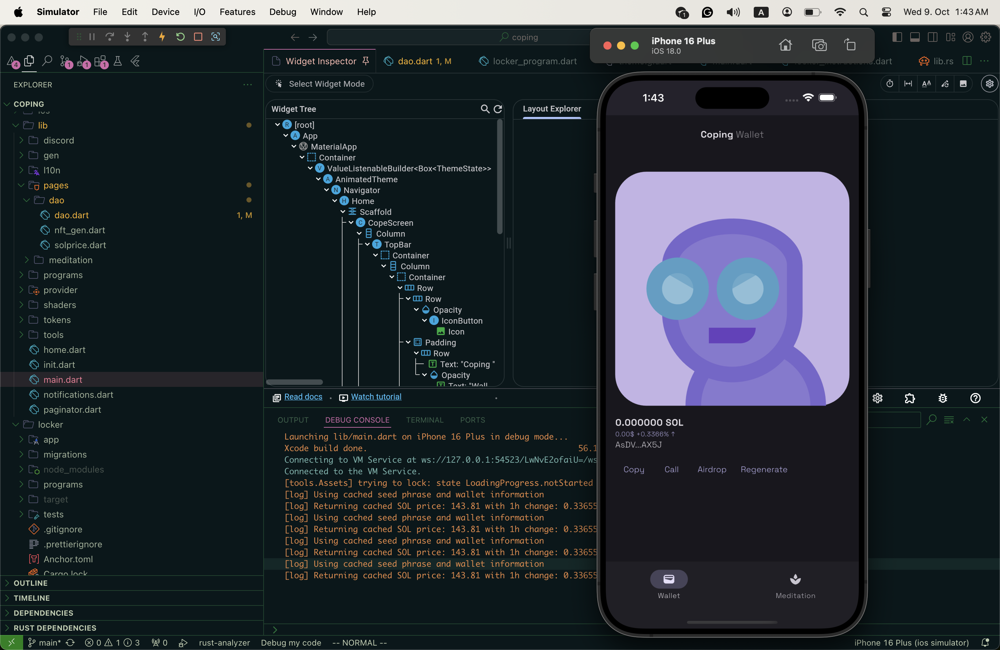

# dependencecoping

Coping Solana mobile app

## Getting Started

This project is a starting point for a Flutter application.

A few resources to get you started if this is your first Flutter project:

- [Lab: Write your first Flutter app](https://docs.flutter.dev/get-started/codelab)
- [Cookbook: Useful Flutter samples](https://docs.flutter.dev/cookbook)

For help getting started with Flutter development, view the
[online documentation](https://docs.flutter.dev/), which offers tutorials,
samples, guidance on mobile development, and a full API reference.

## Run

- flutter build ipa --release --export-method app-store
- flutter pub run flutter_launcher_icons
- flutter pub run flutter_native_splash:create
- flutter gen-l10n
- flutter packages pub run build_runner build

## Solana

1. install solana's toolset https://solana.com/docs/intro/installation#install-dependencies
2. run solana locally `solana-test-validator`
3. airdrop your self `solana airdrop 50 -ul DVEqKrqiNPB8XLN9UmgLuEjEbdEovS9qKiLfcENTo23F`